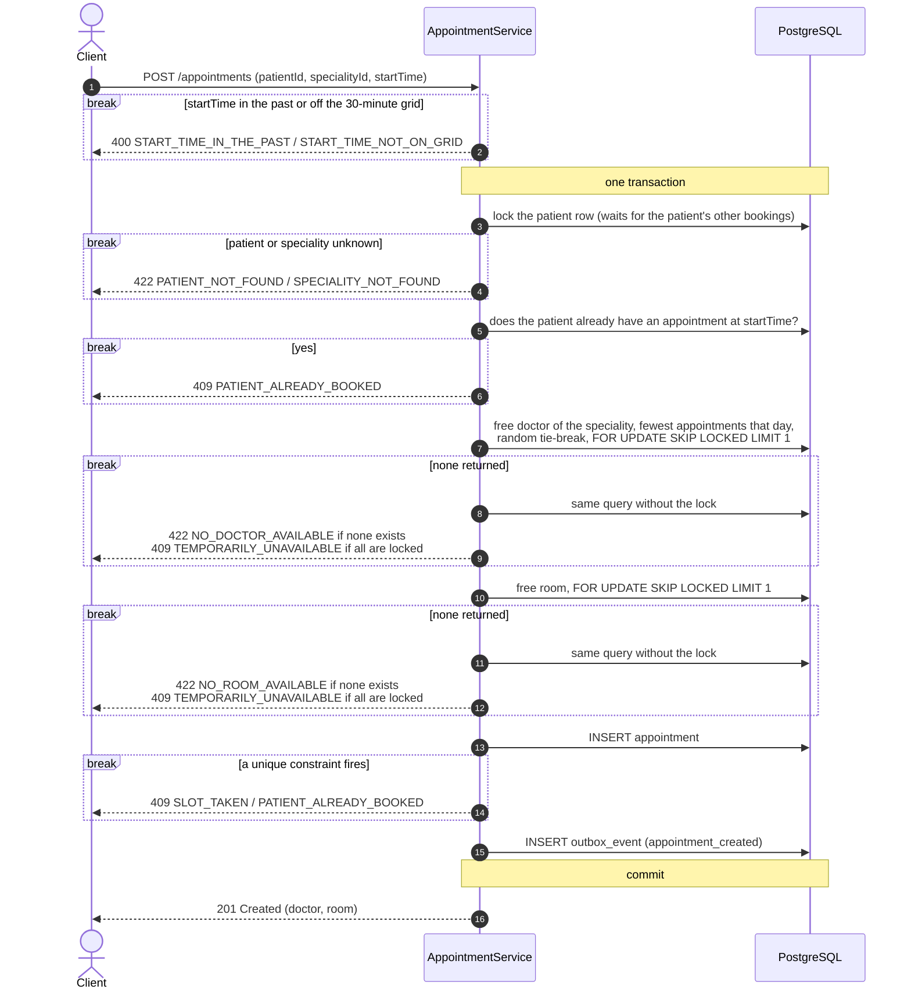
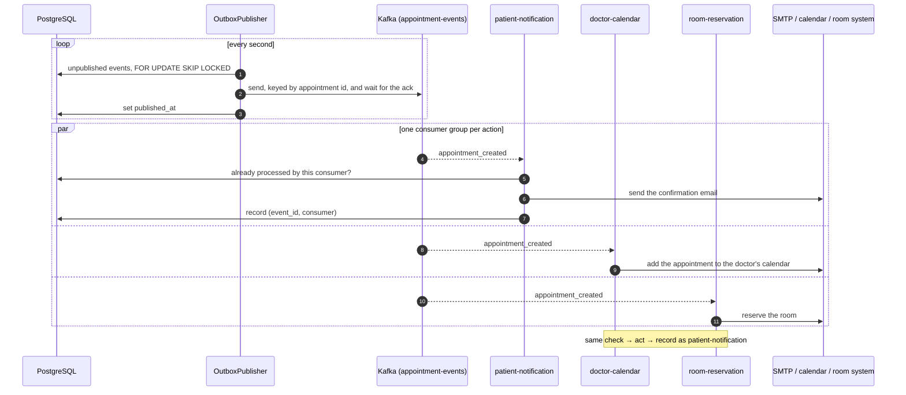
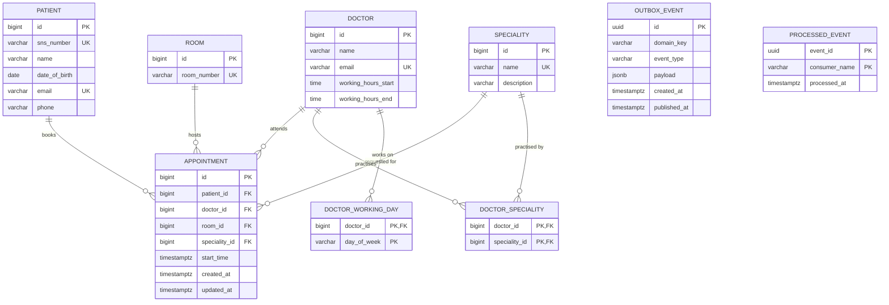
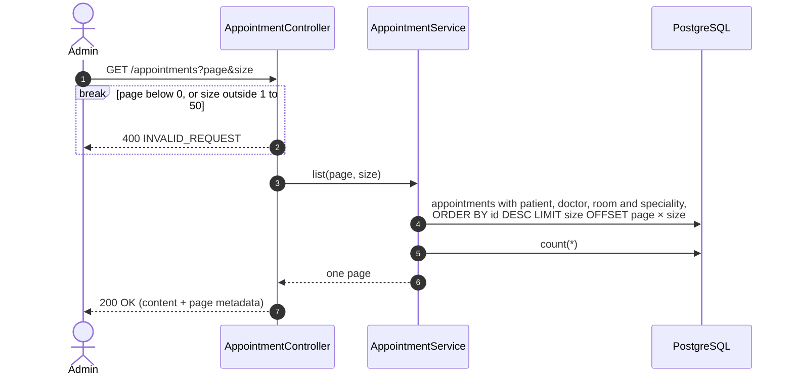

# Diagrams

1. [Booking an appointment](#1-booking-an-appointment)
2. [After the booking](#2-after-the-booking)
3. [Data model](#3-data-model)
4. [Listing appointments](#4-listing-appointments)

---

## 1. Booking an appointment

The unique constraints on `(doctor_id, start_time)`, `(room_id, start_time)` and `(patient_id, start_time)` are
what guarantee there is no overbooking, with any number of instances running. The locks only keep concurrent
requests from colliding: with `SKIP LOCKED`, a booking that finds a doctor or room held by another transaction
takes the next candidate instead of waiting. The patient row is the one lock that waits, so two requests from the
same patient are answered one after the other and the second always sees the first.

No external system is called inside the transaction.

---

## 2. After the booking

The publisher sends first and marks second, so an event can be sent twice but never lost. Each consumer checks
`processed_event` before acting and records the event after, which absorbs the duplicates. A failing action is
tried four times, with exponential backoff starting at one second; after that it is logged and the consumer moves on.
Published outbox rows are deleted after 30 days.

The email goes out over SMTP (Mailpit, locally). The calendar and room-reservation adapters are fakes that log.

---

## 3. Data model

Constraints on `appointment`:

- `UNIQUE (doctor_id, start_time)`: a doctor is never booked twice at the same time.
- `UNIQUE (room_id, start_time)`: same for rooms.
- `UNIQUE (patient_id, start_time)`: same for patients, which also stops a double submit from creating two bookings.

All three compare `start_time` for equality. With a fixed 30-minute grid, equal start times are the only way two
appointments can overlap.

`outbox_event` and `processed_event` have no foreign keys to the core tables: they are messaging infrastructure and
can be dropped or replaced without touching the domain schema.

---

## 4. Listing appointments

Newest bookings come first. There are no filters.
