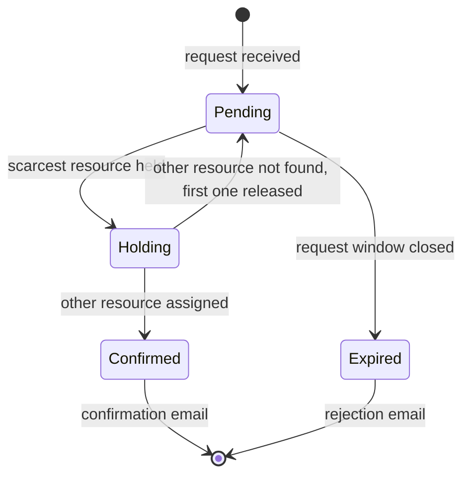

# Next version

This MVP assumes that this service is the source of truth for doctor and room availability. Below is how I would
change the design if that's not the case, and some other improvements.

## External systems as the source of truth

In a real clinic, the doctor's calendar probably has more than the appointments of this service (personal
commitments, other clinics), and rooms can be shared with other departments. If these systems are the source of
truth, "no doctor available" is only true at that moment. Someone may cancel later, so the request should wait
instead of being rejected.

My idea for this case:

- The request is saved as pending and the API answers right away. The patient receives an email when it's
  confirmed or rejected. It works like a waiting list for that slot.
- The scarcest resource (usually the doctor) is allocated first and held for a few minutes while looking for the
  other one. If the second one isn't found, the first is released and the request tries again later.
- Trying again means checking again on a schedule, or when the external system notifies a change (a cancellation,
  for example).
- The request has a time window, for example 24 hours and never after the appointment time. If it isn't confirmed
  by then, it's rejected and the patient is notified.
- The oldest request goes first, unless a business rule says otherwise (a private appointment before one covered
  by insurance, for example).

The appointment would have a doctor and a room that can still be empty, and a status:

Each request becomes a long running process, with waits, timers, retries and resource releases. An orchestrator
like Temporal fits well here, with the cost of one more piece of infrastructure. A simpler option is a table of
pending requests read by a scheduler, the same way the outbox works today.

The trade-offs are that the overbooking guarantee moves to the external systems, and the client doesn't get the
final answer in the response. For the scope of this MVP the synchronous approach is simpler and answers in
milliseconds, so I kept it.

## Other improvements

Some other improvements I decided to leave out of scope:

- Cancelling and rescheduling.
- An endpoint to check availability before booking.
- Appointments with different durations.
- Filters (date, doctor, patient) and cursor pagination in the listing.
- API-first, with the contract in an `openapi.yaml`.
- Dead letter topic and replay for events that keep failing.
- Store the result of each post-booking action (email, calendar, room), instead of only logging the failures.
- Personal data: health data needs careful handling in production. Here the logs only have ids and the Kafka topic
  keeps the events for 7 days.
- Authentication, roles and permissions.
